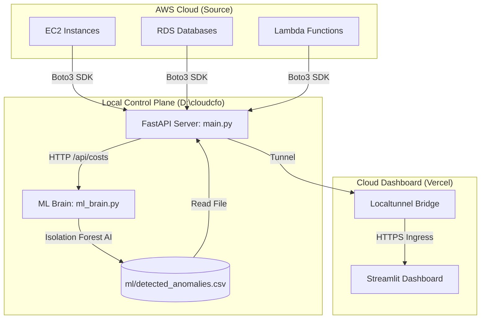

# 🌊 CloudCFO Data Architecture & Flow

This document explains the "Live Audit" journey—how data moves from your active AWS account into the anomaly detection engine and onto the dashboard.

## 🏗️ Architecture Diagram

---

## 🚀 The 4-Step Journey

### 1. The Live Discovery (`automation/api/main.py`)
The FastAPI server is the "Gatekeeper" to AWS. It uses the **Boto3 Python SDK** to fetch real-time inventory.
- **Endpoint**: `GET /api/costs`
- **Logic**: It identifies running EC2 instances, RDS clusters, and Lambda functions.
- **ARN Construction**: It dynamically constructs full Amazon Resource Names (ARNs) for every asset so the dashboard can "deep link" into the AWS console.

### 2. The AI Audit (`ml/ml_brain.py`)
The ML Brain is the "Analyst". It is triggered by the background scheduler every hour (or manually via `/api/ml/trigger`).
- **Data Ingestion**: It calls the local API's `/api/costs` endpoint using a secure `X-API-KEY`.
- **Feature Engineering**: It calculates `cost_per_cpu` to detect "Zombie" resources (high cost, low usage).
- **Isolation Forest**: It trains a machine learning model on the live data to flag statistical outliers.

### 3. CSV Persistence (`ml/detected_anomalies.csv`)
Results from the ML Brain are saved to this **Central CSV**. 
- It stores timestamps, costs, anomaly scores, and "Suggested Actions" (e.g., `STOP_INSTANCE`).
- This file acts as the "Source of Truth" for the dashboard.

### 4. The Dashboard Handshake (`streamlit_app.py`)
The Streamlit dashboard (on Vercel) connects to your laptop via **Localtunnel**.
- Every time you refresh the dashboard, it makes a request to `https://your-tunnel.loca.lt/api/ml/anomalies`.
- The FastAPI server reads the **CSV file**, converts it to JSON, and sends it through the tunnel to the cloud.

---

## 🔍 Verification Checklist
If your dashboard is empty, check this chain:
1. **AWS**: Are your `~/.aws/credentials` valid?
2. **Backend**: Is `uvicorn` running on `0.0.0.0:8000`?
3. **ML CSV**: Does `ml/detected_anomalies.csv` contain rows? (Check this file manually).
4. **Tunnel**: Is your `.loca.lt` URL active in the dashboard sidebar?

> [!TIP]
> You can manually force a complete "Refresh" of the data flow by running the `python ml/ml_brain.py` script directly in your terminal at any time!
